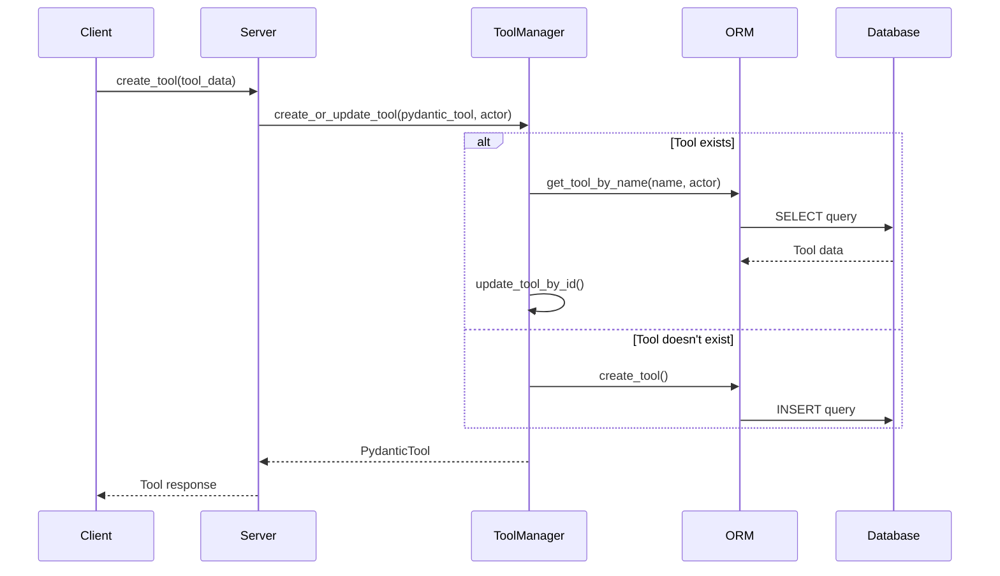
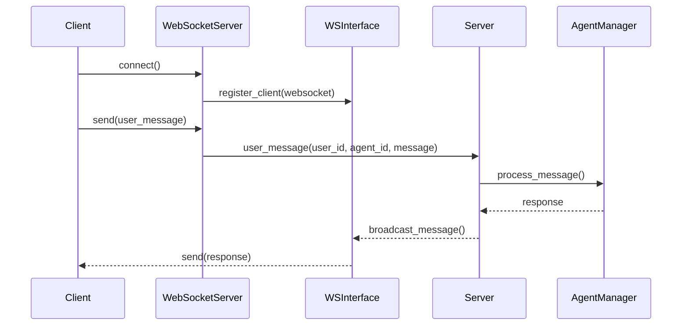
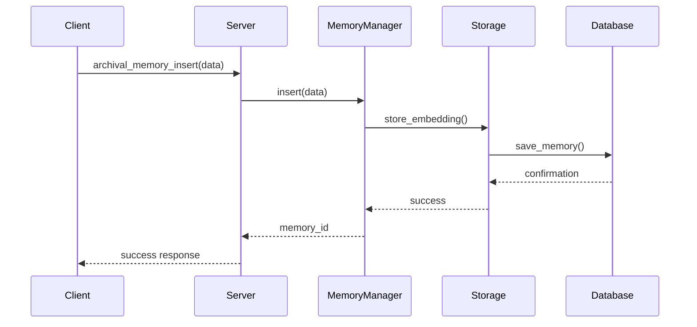
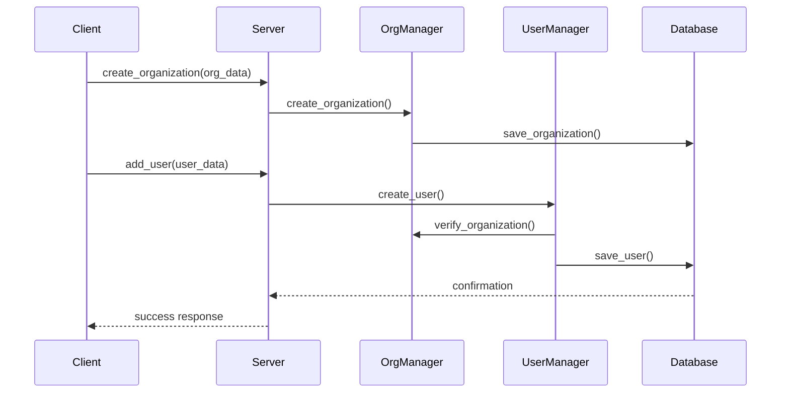
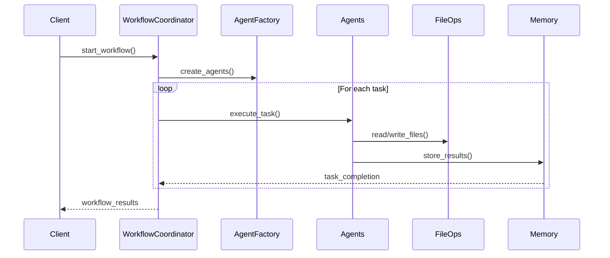
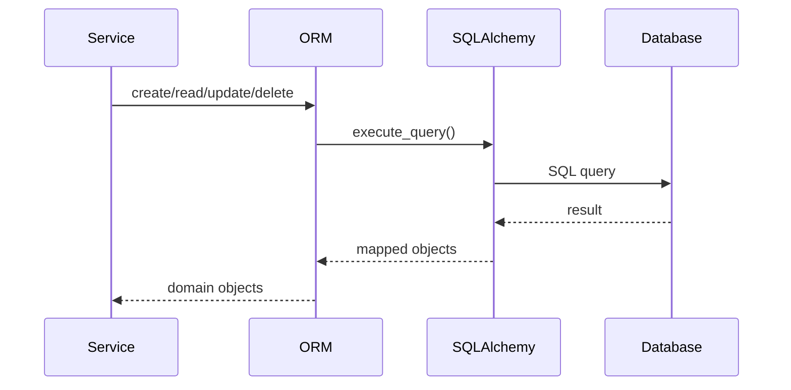

# Method Interactions in Letta

This document illustrates the key method interactions and data flows in the Letta system using mermaid diagrams.

## Tool Management Flow

The following diagram shows how tools are created and managed in the system:

## WebSocket Communication Flow

The following diagram shows the WebSocket-based communication between client and server:

## Memory Operations Flow

The following diagram shows how memory operations are handled:

## Organization and User Management Flow

The following diagram shows organization and user management interactions:

## Agent Workflow System

The following diagram shows the agent workflow system:

## Database Operations Flow

The following diagram shows the core database operations:

## Key Implementation Details

### Tool Management
- Tools are managed through the `ToolManager` class which handles CRUD operations
- Each tool is stored with metadata including name, description, source code, and JSON schema
- Tools are organization-scoped, meaning they belong to specific organizations

### WebSocket Communication
- The `WebSocketServer` handles real-time bidirectional communication
- Messages are processed through the `WebSocketInterface` which maintains client connections
- Supports both synchronous and asynchronous operations through `SyncWebSocketInterface` and `AsyncWebSocketInterface`

### Memory System
- Implements both archival and recall memory types
- Uses embeddings for semantic search capabilities
- Supports async operations for better performance

### Database Layer
- Uses SQLAlchemy for ORM operations
- Implements both sync and async database operations
- Maintains data consistency through transactions

## Best Practices

1. **Error Handling**
   - All database operations should be wrapped in try-except blocks
   - WebSocket connections should handle disconnections gracefully
   - Memory operations should validate data before storage

2. **Performance**
   - Use async operations for I/O-bound tasks
   - Implement connection pooling for database operations
   - Cache frequently accessed data

3. **Security**
   - Validate all user input
   - Implement proper authentication and authorization
   - Use secure WebSocket connections when needed

4. **Scalability**
   - Design services to be stateless when possible
   - Use message queues for long-running operations
   - Implement proper connection management

## Common Patterns

1. **Manager Pattern**
   - Each major component has a manager class (ToolManager, UserManager, etc.)
   - Managers handle business logic and coordinate with the ORM layer

2. **Interface Pattern**
   - WebSocket communication is abstracted through interfaces
   - Allows for different implementation strategies (sync/async)

3. **Factory Pattern**
   - Used in agent creation and workflow management
   - Provides flexibility in object creation

4. **Repository Pattern**
   - Implemented through the ORM layer
   - Provides clean separation of data access logic 